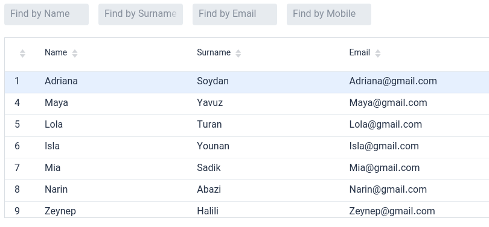

# HR Job Interview Frontend API




## Description
This is Progressive Web Apps (PWA) by the help of Vaadin UI technology used in this APP, which can be used to create a UI layer without the need to create web files like html or css. 
The main use case for the API is represents a store UI for interview entities. The backend service of this application will hold all records in database and provide
REST API. Each entity of the interview represents unique candidate entity and its related interview entities that is saved in the database.
The API implemented by the help of Java version 11, Spring-Boot version 2.5.5 and Vaadin version 14.7.1. 


The API uses a FeignClient repository to call backend endpoints.

## Rest endpoints that are called:

### POST `/interviews`

#### Submit a new interview data.

#### Request Body:

```json 
{
  "commentForCandidate": "some comment",
  "email": "sample@gmail.com",
  "interviewDateTime": "2021-10-07T06:49:04.401Z",
  "mobile": "+989562651623",
  "name": "Kayan",
  "salaryExpectation": 3000,
  "surname": "Yulduz"
}
```
curl example:
```
curl -X POST "http://localhost:8081/interviews" -H "accept: */*" -H "Content-Type: application/json" -d "{ \"commentForCandidate\": \"some comment\", \"email\": \"sample@gmail.com\", \"interviewDateTime\": \"2021-10-07T06:49:04.401Z\", \"mobile\": \"+989562651623\", \"name\": \"Kayan\", \"salaryExpectation\": 3000, \"surname\": \"Yulduz\"}"
```
#### Response Status Code: 
0. 201 – in case of success when submit a new interview
0. 400 - if the request body is invalid (e.g. mobile or email is invalid)


##
### Retrieve /interviews

#### Get all interviews.

curl example:
```
curl -X GET "http://localhost:8081/interviews" -H "accept: */*"
```

#### Response Status Code: 
0. 200 – in case of success
0. 400 - if the path variable is invalid

#### Response Body: 
```json
[
  {
    "id": 1,
    "name": "Adriana",
    "surname": "Soydan",
    "mobile": "+901234567894",
    "email": "Adriana@gmail.com",
    "interviewDateTime": "2020-10-05T22:01:15.055",
    "salaryExpectation": 6000,
    "commentForCandidate": "comment-1"
  },
  {
    "id": 2,
    "name": "Ingrid",
    "surname": "Uzun",
    "mobile": "+909876543212",
    "email": "Ingrid@gmail.com",
    "interviewDateTime": "2021-11-03T18:12:06.055",
    "salaryExpectation": 4000,
    "commentForCandidate": "comment-2"
  }
]
```

##
### GET `/interviews/{id}`

#### Retrieve a specified interview.

url example:
```
curl -X GET "http://localhost:8081/interviews/1" -H "accept: */*"
```
#### Response Body: 
```json
{
  "id": 1,
  "name": "Adriana",
  "surname": "Soydan",
  "mobile": "+901234567894",
  "email": "Adriana@gmail.com",
  "interviewDateTime": "2020-10-05T22:01:15.055",
  "salaryExpectation": 6000,
  "commentForCandidate": "comment-1"
}
```

##
### GET `/interviews/`

#### Search interview by following query params including:
0. candidate name 
0. candidate surname 
0. candidate email 
0. candidate mobile
 

curl example:
```
curl -X GET "http://localhost:8081/interviews/?email=ana&mobile=23&name=A&surname=y" -H "accept: */*"
```

#### Response Body: 
```json
[
  {
    "id": 1,
    "name": "Adriana",
    "surname": "Soydan",
    "mobile": "+901234567894",
    "email": "Adriana@gmail.com",
    "interviewDateTime": "2020-10-05T22:01:15.055",
    "salaryExpectation": 2000,
    "commentForCandidate": "comment-1"
  },
  {
    "id": 2,
    "name": "Isla",
    "surname": "Younan",
    "mobile": "+901414562394",
    "email": "Adriana@gmail.com",
    "interviewDateTime": "2019-09-05T22:01:15.055",
    "salaryExpectation": 35000,
    "commentForCandidate": "comment-2"
  }
]
```

#### Response Status Code: 
0. 200 – in case of success
0. 400 - if the path variable is invalid


##
### DELETE `/interviews/{id}`

#### Delete a specified interview.

curl example:
```
curl -X DELETE "http://localhost:8081/interviews/1" -H "accept: */*"
```

#### Response Status Code: 
0. 204 – in case of success
0. 400 - if the path variable is invalid


##
### Implementation Details

This is a curd application for interview data. There is no specified business rules in the services. 
Candidate email and mobile validation done for the well-format.

There are unit and integration tests in "src/test" package, those all also covered.
[here](src/test/java/com/interview)


##
### Build:

0. To run maven command does not need an installed version of maven on the running machine.
The main folder of the project includes maven wrapper files. It is possible easily run following maven command using this library:
e.g. `./mvnw clean package`, ...
0. The application should be available at `localhost:8080` (if you wish to change the port of production environment modify the server.port config in the [config file](/src/main/resources/application.properties)


Run app
-------------------
The application can be run with maven, java jar or docker commands.
    
Run by Maven:
  
    # start spring boot server:    
    mvn spring-boot:run OR ./mvnw spring-boot:run 

        
Run by jar file:
    
    # clean target and build a jar file:    
    mvn clean package  OR ./mvnw clean package
    
    # for skipping tests:
    mvn -DskipTests=true clean package  OR ./mvnw -DskipTests=true clean package        
    
    # run the jar file:
    java -jar target/hr-job-interview-frontend-0.0.1-SNAPSHOT.jar
 
 
 
Run whole project in 3 fast-way steps by docker-compose:
 
    # First go to the top folder of the project root: 
      cd ..
    
    # build backend:
      mvn -f hr-job-interview-backend clean package
    
    # build frontend:
      mvn -f hr-job-interview-frontend clean package
    
    # Then run the docker-com command to run backend, frontend and database contaners:  
      docker-compose up
